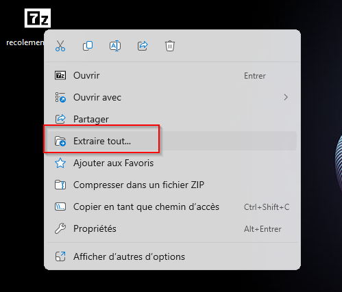
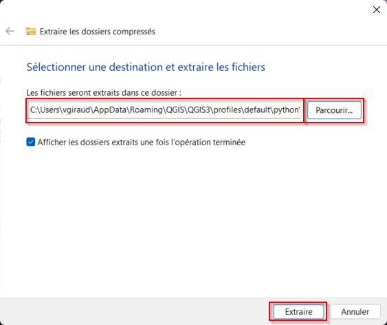
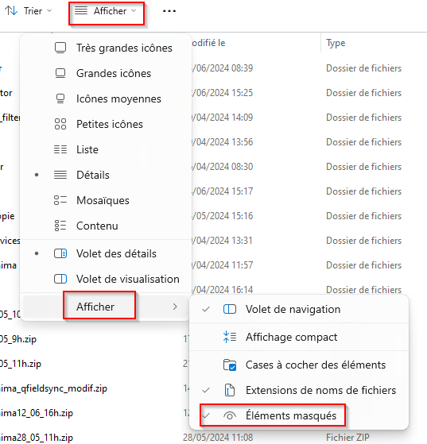
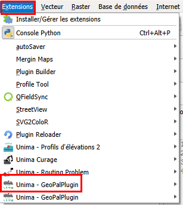
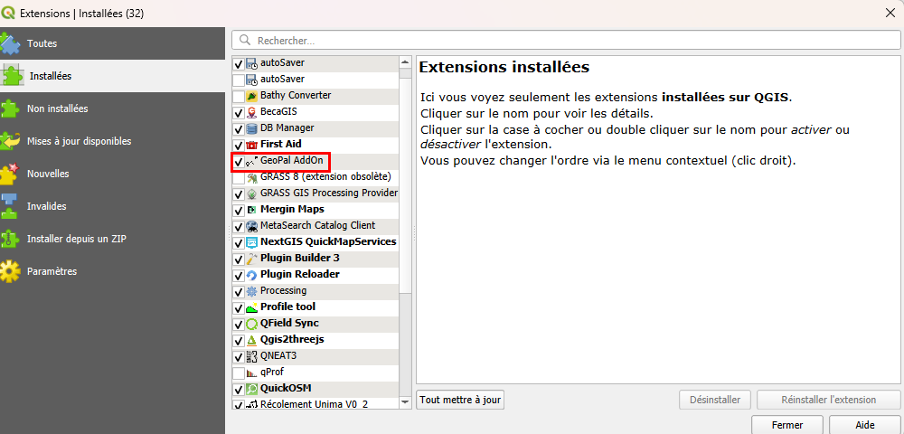

# Installation du plugin GeoPal (QGIS)

Ce guide explique comment installer le plugin **GeoPal** dans QGIS.

## 1. Décompresser l'archive

Le plugin vous sera fourni sous forme d'un fichier `.zip` contenant le dossier du plugin **geopal**. Il faut donc le décompresser.

Pour ce faire : *clic-droit > extraire tout*.



*Figure 1 : extraire un fichier compressé*

## 2. Choisir le dossier de destination

Une fenêtre s'ouvre alors, vous demandant le chemin d'accès où extraire ce fichier.

Vous devrez renseigner ce chemin d'accès (en cliquant sur *parcourir* ou en l'écrivant directement) :



*Figure 2 : choix du dossier d'export*

Utilisez le chemin d'accès suivant :

```
C:\Users\Nom_utilisateur\AppData\Roaming\QGIS\QGIS3\profiles\default\python\plugins
```

> ⚠️ Remplacez `Nom_utilisateur` par votre nom d'utilisateur.

Le répertoire **AppData** n'est pas visible par défaut. Pour l'afficher :

Dans l'explorateur Windows, aller dans *Afficher > Afficher > Éléments masqués*.



*Figure 3 : afficher les dossiers cachés*

C'est à cet endroit que tous les plugins sont stockés par QGIS. Une fois la décompression terminée, les deux dossiers se trouveront dans votre répertoire d'extensions de QGIS.

**Le plugin est installé !**

## 3. Vérifier l'installation

Pour vérifier que l'installation s'est déroulée comme prévu, lancez QGIS. De nouvelles icônes doivent apparaître dans la barre d'outils et dans le menu des extensions :




*Figure 4 : emplacement du plugin dans le menu extension*

## 4. Activer le plugin (si nécessaire)

Si les icônes n'apparaissent ni dans le menu des extensions ni dans la barre d'outils, il faut activer l'extension.

Pour l'activer, allez dans le gestionnaire d'extensions : *Extensions > Installer/Gérer les extensions*, puis cochez l'extension **GeoPal** :



*Figure 5 : emplacement du plugin dans le menu gérer les extensions*

Si les icônes ne sont toujours pas apparues, faites un clic-droit dans la barre d'outils QGIS et sélectionnez **GeoPal Plugin**.
